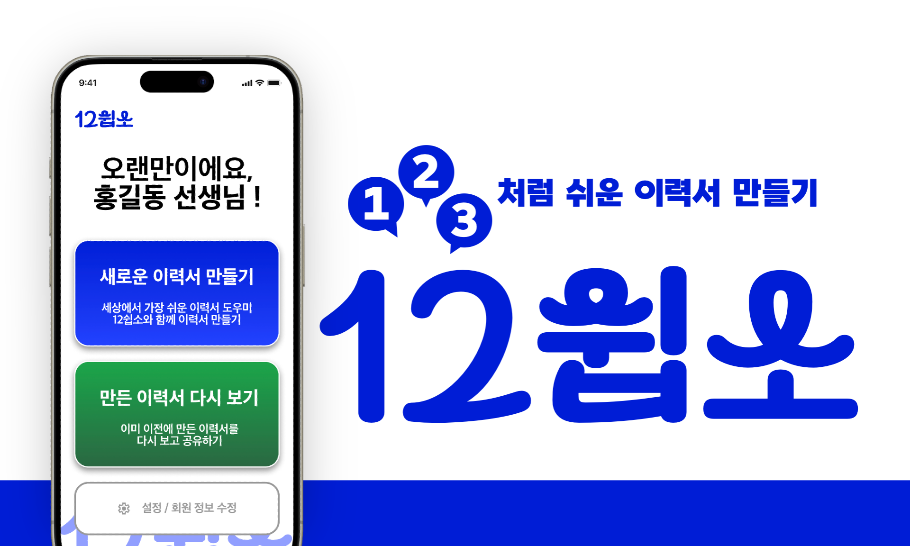
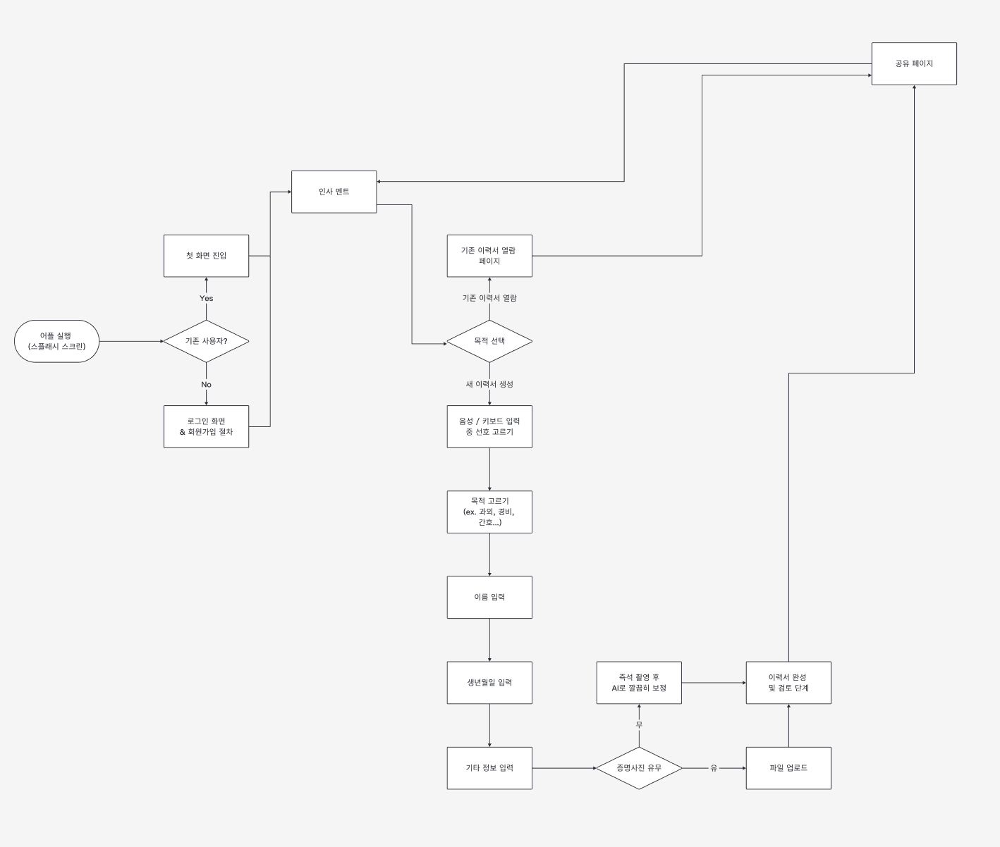
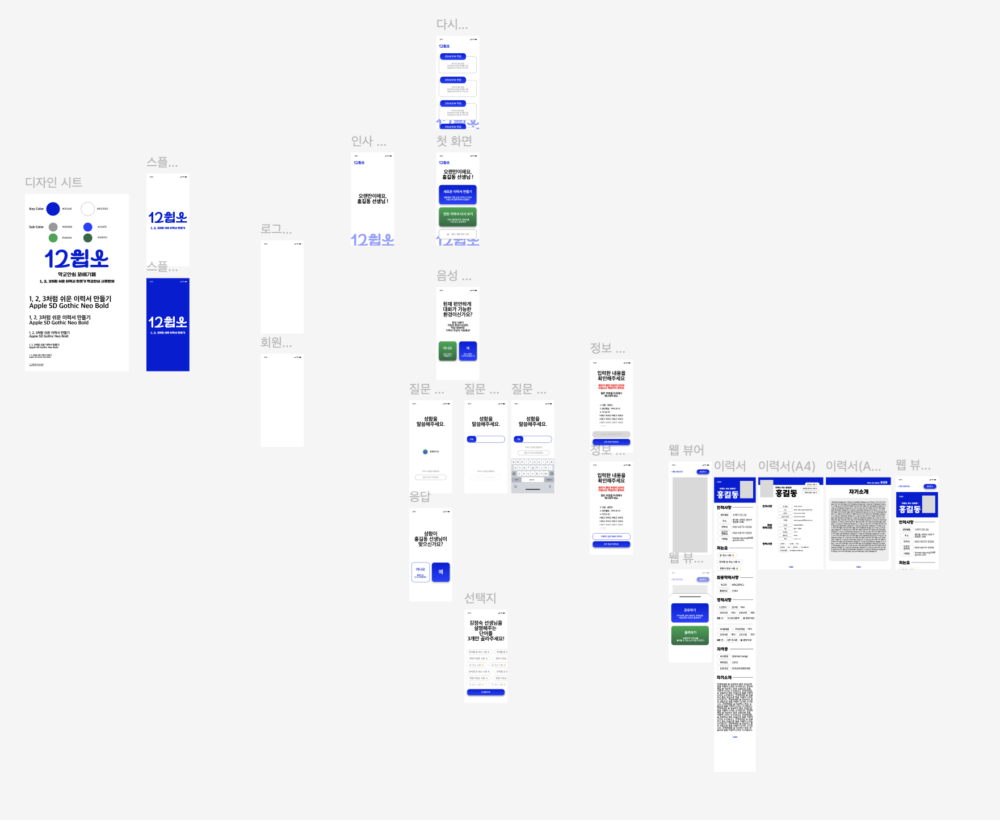

<body>
	
 
 
<nav>
	<h2>목차</h2>
	<ol>
		<li><a href="#overview">서비스 개요</a> <ol>
				<li><a href="#demovideo">시연 영상</a></li>
				<li><a href="#target">타겟 사용자</a></li>
				<li><a href="#members">구성 인원</a></li>
			</ol>
		</li>
		<li><a href="develop">개발 진행</a> <ol>
				<li><a href="#structure">기술적 구조</a></li>
				<li><a href="#documents">산출물</a></li>
			</ol>
		</li>
	</ol>
</nav>
 
<h3 id="overview"> 서비스 개요 </h3>

<ul>
	<li><b>“1, 2, 3처럼 쉬운 이력서 만들기"를 모토로, 디지털 취약계층을 대상으로 한 이력서 생성 서비스. </b></li>
	<li>대화형 UI를 통해 정보를 간단하고 편리하게 제공하면, 생성형 AI와 결합된 이력서를 최종적으로 산출</li>
	<li>해당 이력서를 모바일 웹 페이지 형식 혹은 실제 출력물 형태로 빠르게 공유 가능</li>
</ul>

<h4 id="demovideo"> 시연 영상 </h4>

<h4> 서비스 기획 동기 </h4>

	<ol>
		<li> <b> 내적 동기 </b> : 사회적 문제와 밀접하게 맞닿아 있는, 공공 문제 해결을 위한 프로젝트를 진행하고 싶은 구성원들의 의지 </li>
		<li> <b> 외적 동기 </b> <ul>
			<li> 초고령화 현상이 진행되면서 노인층의 일자리 문제가 대두 </li>
			<li> 구직에 꼭 필요한 것 중 하나가 바로 이력서 </li>
			<li> 이력서 작성에 어려움을 겪는 노년층이 많아, 각종 공공기관에서 교육 등을 실행하고 있음 </li> </ul>
		</li>
	</ol>

<h4 id="target"> 타겟 사용자 </h4>

	<ol>
		<li> 이력서 작성의 <b>개념 자체를 어려워하는 노년층</b> 등 </li>
		<li> 이력서에 대해서는 충분히 알고 있지만, 디지털로 작성하는 데에 어려움을 겪는 <b>디지털 취약 계층</b> </li>
	</ol>

<h4 id="members"> 구성원 </h4>

	<ol>
		<li> 한국외국어대학교 Software&AI를 이중전공하는 학생 4명으로 구성</li>
		<li> <b>구성인원</b> (팀장 외 가나다순) <ol>
			<li> <b>이승용</b> : 팀장, 언어인지과학과 전공, 서비스 기획 및 프로젝트 일정 전반 조율, UX 기획 및 디자인 </li>
			<li> <b>공예진</b> : 브라질학과, 백엔드 및 프론트엔드 등 개발 전반 총괄 </li>
			<li> <b>이하영</b> : 체코슬로바키아어과, 프론트엔드 개발 </li>
			<li> <b>정민서</b> : GBT학부, 백엔드 개발 </li>
		</ol>
	</ol>

 
 
<h3 id="develop"> 개발 진행 </h3>

<h4 id="structure"> 기술적 구조 </h4>

	<ul>
		<li> <b>프론트엔드</b> :  </li> 
		<li> <b>백엔드</b> <ol> 
			<li> 코드 :  </li>
			<li> 서버 :  </li> </ol>
		</li>
	</ul>

<h4 id="documents"> 산출물 </h3>

	<ol>
		<li>    
			<b> <a href="https://www.figma.com/design/KkZ2lSWDFk2kUNPaW08VKe/%EC%9D%B4%EB%A0%A5%EC%84%9C-%2F-Flow-Chart?node-id=1-223&t=BXzbot8PLdQ2gWqF-1"> User Flow </a> </b> </li>
		<li>    
			<b> <a href="https://www.figma.com/design/v0zkPv187KX5iAtcJvVVM6/12%EC%89%BD%EC%86%8C?node-id=0-1&t=5BL4KGdNzo9ESjE3-1"> UI Wireframe </a> </b> </li>
		<li> <b> FRD </b> </li>
	</ol>

</body>
