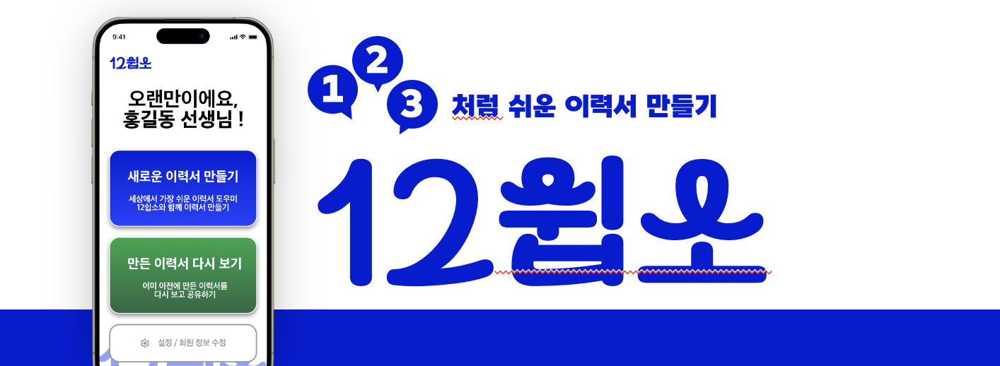

<body>
	
	
<h2> 서비스 개요 </h2>

<ul>
	<li><b>“1, 2, 3처럼 쉬운 이력서 만들기"를 모토로, 디지털 취약계층을 대상으로 한 이력서 생성 서비스. </b></li>
	<li>대화형 UI를 통해 정보를 간단하고 편리하게 제공하면, 생성형 AI와 결합된 이력서를 최종적으로 산출</li>
	<li>해당 이력서를 모바일 웹 페이지 형식 혹은 실제 출력물 형태로 빠르게 공유 가능</li>
</ul>

<h3> 서비스 기획 동기 </h3>

	<ol>
		<li> <b> 내적 동기 </b> : 사회적 문제와 밀접하게 맞닿아 있는, 공공 문제 해결을 위한 프로젝트를 진행하고 싶은 구성원들의 의지 </li>
		<li> <b> 외적 동기 </b> <ul>
			<li> 초고령화 현상이 진행되면서 노인층의 일자리 문제가 대두 </li>
			<li> 구직에 꼭 필요한 것 중 하나가 바로 이력서 </li>
			<li> 이력서 작성에 어려움을 겪는 노년층이 많아, 각종 공공기관에서 교육 등을 실행하고 있음 </li> </ul>
		</li>
	</ol>

<h3> 구성원 </h3>

	<ol>
		<li> 한국외국어대학교 Software&AI를 이중전공하는 학생 4명으로 구성</li>
		<li> <b>구성인원</b> (팀장 외 가나다순) <ol>
			<li> <b>이승용</b> : 팀장, 언어인지과학과 전공, 서비스 기획 및 프로젝트 일정 전반 조율, UX 기획 및 디자인 </li>
			<li> <b>공예진</b> : 브라질학과, 백엔드 및 프론트엔드 등 개발 전반 총괄 </li>
			<li> <b>이하영</b> : 체코슬로바키아어과, 프론트엔드 개발 </li>
			<li> <b>정민서</b> : GBT학부, 백엔드 개발 </li>
		</ol>
	</ol>

</body>
